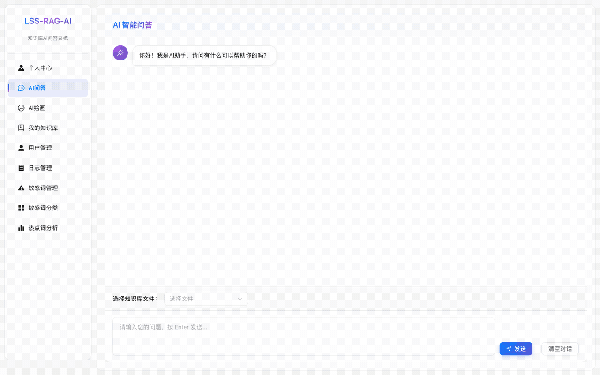
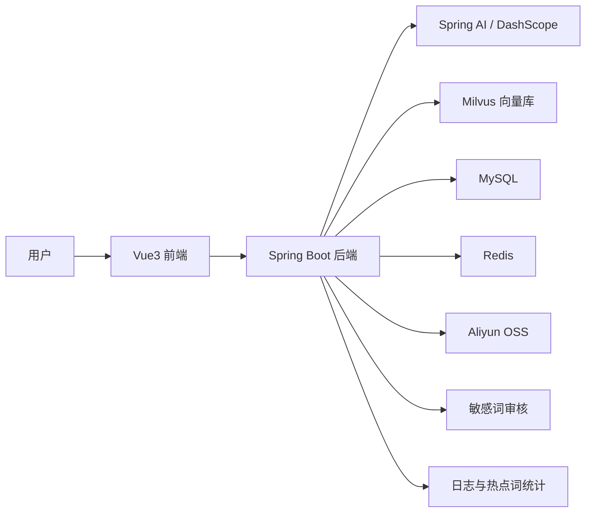
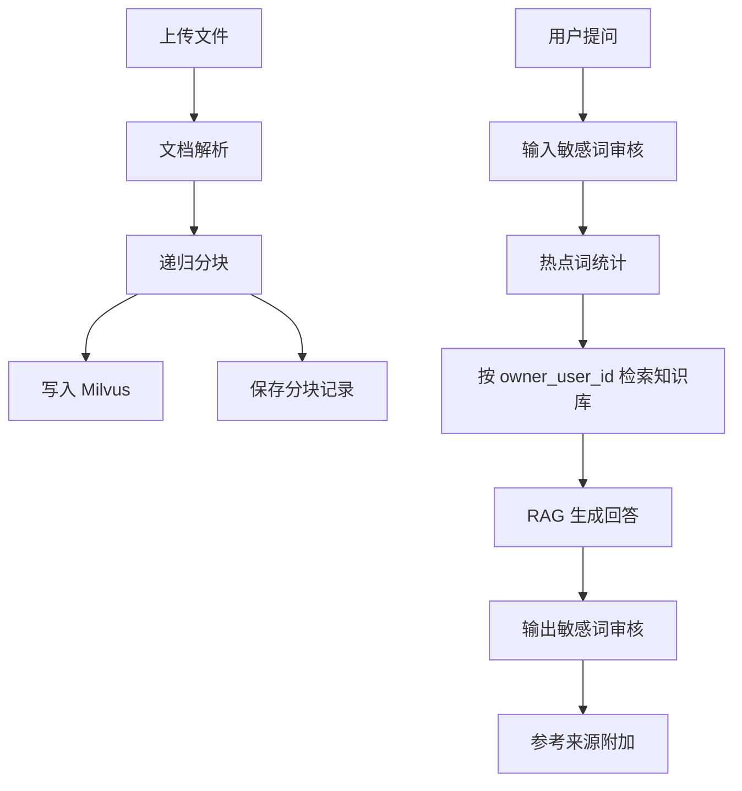
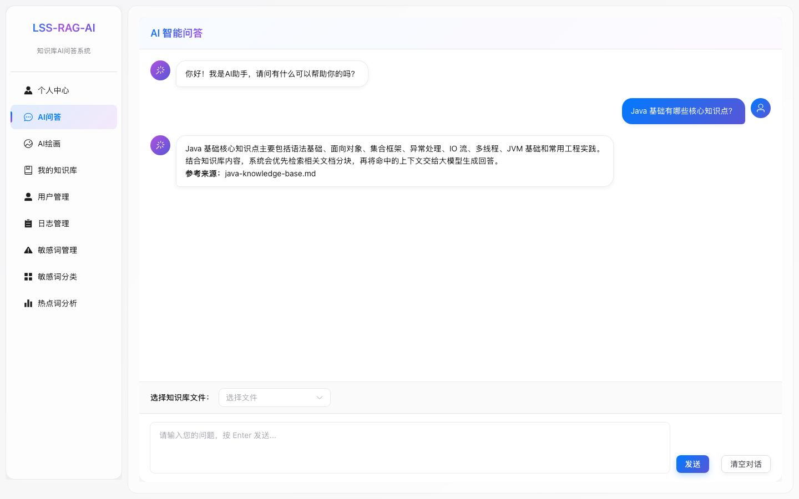
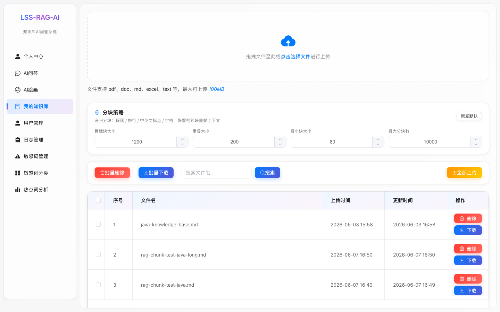
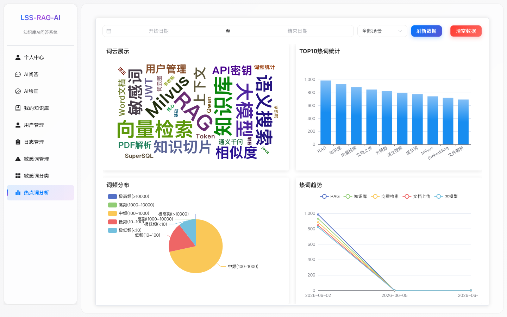
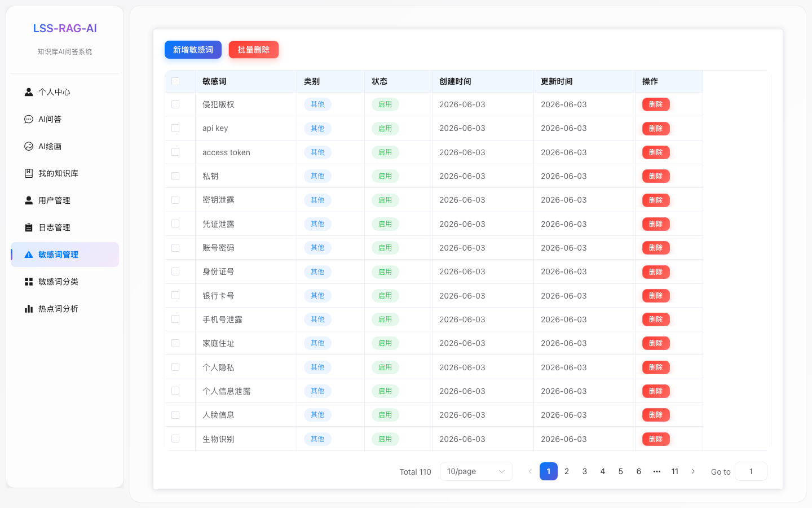
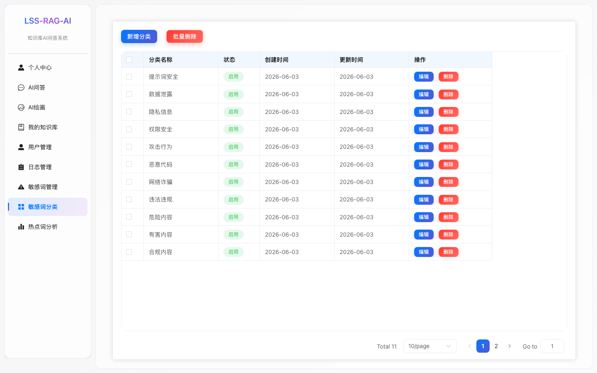
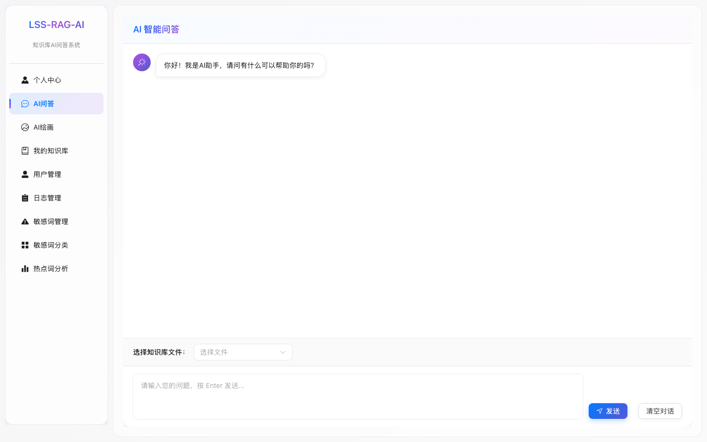

# LSS RAG AI 知识库问答系统

基于 Spring AI + Milvus + Vue3 的个人知识库 RAG 问答系统。项目围绕“文档上传、智能分块、向量检索、AI 问答、来源引用、敏感词审核、热点词分析、多用户知识库隔离”等能力构建，适合作为 RAG 工程化实践项目展示。

## 演示



## 项目亮点

- 实现知识库文件上传、解析、递归分块、向量化入库和 RAG 问答。
- 支持主流实用分块策略，上传时可配置 chunk size、overlap、最小分块和最大分块数。
- 支持分块持久化、分块预览、文件详情、删除同步清理向量、重建索引。
- AI 问答支持知识库来源引用，回答末尾展示参考来源、分块编号、相似度和内容预览。
- 提供 RAG 检索质量评估接口，可评估 topK、命中关键词、平均相似度和召回片段。
- 实现问答输入/输出双向敏感词检测，支持分类管理、风险等级、命中日志和分类统计。
- 热点词分析基于真实用户问答日志自动分词统计，支持日期范围和问答场景筛选。
- 支持 JWT 登录认证和多用户知识库隔离，用户只能访问自己的知识库文件和向量检索结果。
- 数据库主键统一规范为 `BIGINT AUTO_INCREMENT`，Java 实体统一使用 `Long + IdType.AUTO`。

## 功能模块

| 模块 | 功能 |
| --- | --- |
| 用户中心 | 注册、登录、JWT 鉴权、当前用户信息、修改资料、修改密码、退出登录 |
| 我的知识库 | 文件上传、文件列表、下载、删除、文件详情、分块预览、重建索引 |
| 分块策略 | 递归分块、重叠窗口、最小分块合并、上传参数可配置 |
| AI 问答 | 普通聊天、RAG 知识库问答、上下文记忆、Markdown 渲染 |
| 来源引用 | 根据检索片段生成 `[来源1]` 引用和参考来源列表 |
| RAG 评估 | 检索命中、关键词覆盖率、相似度、召回片段明细 |
| 敏感词审核 | 敏感词库、分类管理、输入拦截、输出拦截、命中日志、分类统计、风险等级 |
| 热点词分析 | 用户提问自动分词入库、词云、TOP10、词频分布、真实每日趋势 |
| 日志管理 | 接口日志分页查询和清理 |
| AI 绘画 | DashScope 图像生成接口 |

## 技术栈

### 后端

- Java 17
- Spring Boot
- Spring AI
- Spring AI Alibaba DashScope
- Milvus Vector Store
- MyBatis-Plus
- MySQL
- Redis
- JWT
- Apache Tika / PDFBox
- IK Analyzer
- Aliyun OSS

### 前端

- Vue 3
- TypeScript
- Vite
- Element Plus
- Pinia
- Vue Router
- ECharts / ECharts WordCloud
- Marked / Highlight.js
- fetch-event-source

## 项目结构

```text
.
├── spring-ai-rag-back/              # Spring Boot 后端
│   ├── src/main/java/com/lss/springairag
│   │   ├── controller/              # REST 接口
│   │   ├── service/                 # 业务服务
│   │   ├── entity/                  # 数据库实体
│   │   ├── mapper/                  # MyBatis Mapper
│   │   ├── rag/                     # RAG 分块策略
│   │   ├── advisors/                # RAG Prompt 增强
│   │   └── common/                  # 通用响应、鉴权拦截器等
│   └── src/main/resources
│       ├── mapper/                  # XML Mapper
│       └── sql/                     # 初始化脚本
├── app/sping-ai-rag-front/          # Vue3 前端
│   └── src
│       ├── api/                     # API 封装
│       ├── view/                    # 页面
│       ├── router/                  # 路由
│       └── components/              # 公共组件
├── docs/screenshots/                # 项目截图
└── pom.xml                          # Maven 父工程
```

## 系统架构图



## 核心流程图

```text
上传文件
  -> Tika/PDFBox 解析文档
  -> RecursiveChunkSplitter 递归分块
  -> 写入 Milvus 向量库
  -> 持久化 knowledge_chunk 分块记录

用户提问
  -> 输入敏感词审核
  -> 记录热点词
  -> 按 owner_user_id + source 检索用户自己的知识库
  -> QuestionAnswerAdvisor 构造 RAG 上下文
  -> 生成回答
  -> 输出敏感词审核
  -> 追加参考来源
```



## 页面截图

### AI 问答



### 我的知识库



### 热点词分析



### 敏感词管理



### 敏感词分类



### 系统首页



## 后端启动

### 1. 准备环境

需要本地准备：

- JDK 17+
- Maven 3.9+
- MySQL 8.x
- Redis
- Milvus
- DashScope API Key
- Aliyun OSS 配置

### 2. 修改配置

后端配置文件：

```text
spring-ai-rag-back/src/main/resources/application.yml
spring-ai-rag-back/src/main/resources/application-dev.yml
```

重点配置：

```yaml
spring:
  datasource:
    username: root
    password: 123456
    url: jdbc:mysql://localhost:3306/lss_rag?serverTimezone=UTC
  ai:
    dashscope:
      api-key: ${AI_DASHSCOPE_API_KEY}
    vectorstore:
      milvus:
        client:
          host: localhost
          port: 19530

aliyun:
  alioss:
    endpoint: oss-cn-beijing.aliyuncs.com
    access-key-id: ${alioss.access-key-id}
    access-key-secret: ${alioss.access-key-secret}
    bucket-name: lss-rag
```

### 3. 初始化数据库

创建数据库：

```sql
CREATE DATABASE lss_rag DEFAULT CHARACTER SET utf8mb4 COLLATE utf8mb4_unicode_ci;
```

执行初始化脚本：

```text
spring-ai-rag-back/src/main/resources/sql/init.sql
```

当前仓库已清理掉历史迁移脚本，保留 `init.sql` 作为全量初始化入口。

### 4. 启动后端

```bash
mvn -pl spring-ai-rag-back -am spring-boot:run
```

默认端口：

```text
http://localhost:8989
```

Swagger / Knife4j：

```text
http://localhost:8989/doc.html
```

## 前端启动

```bash
cd app/sping-ai-rag-front
npm install
npm run dev
```

前端默认访问：

```text
http://localhost:8980
```

前端通过 Vite 代理访问后端 `/api/v1`。

## 主要接口

| 接口 | 说明 |
| --- | --- |
| `POST /api/v1/user/login` | 用户登录 |
| `GET /api/v1/user/me` | 获取当前登录用户信息 |
| `POST /api/v1/knowledge/file/upload` | 上传知识库文件 |
| `GET /api/v1/knowledge/contents` | 查询当前用户知识库 |
| `GET /api/v1/knowledge/{id}` | 文件详情 |
| `GET /api/v1/knowledge/{id}/chunks` | 分块预览 |
| `POST /api/v1/knowledge/{id}/reindex` | 重建向量索引 |
| `DELETE /api/v1/knowledge/delete` | 删除知识库文件 |
| `POST /api/v1/ai/rag` | RAG 问答 |
| `GET /api/v1/chat/stream` | 普通流式聊天 |
| `POST /api/v1/rag/evaluate` | RAG 检索质量评估 |
| `GET /api/v1/sensitive/audit/page` | 敏感词命中日志 |
| `GET /api/v1/sensitive/audit/category-stats` | 敏感词分类统计 |
| `GET /api/v1/frequency/getList` | 热点词统计 |

## 简历描述参考

可以写成：

```text
基于 Spring AI + Milvus + Vue3 实现个人知识库 RAG 问答系统，支持文档上传解析、递归分块、向量检索、来源引用、RAG 质量评估、多用户知识库隔离、输入/输出双向敏感词审核和真实问答热点词分析。
```

也可以拆成项目亮点：

- 设计并实现 RAG 知识库问答链路，支持文档解析、递归分块、向量入库、检索增强生成和来源引用。
- 实现知识库分块持久化、chunk 预览、重建索引、删除同步清理向量，提升知识库可维护性。
- 实现 RAG 检索质量评估接口，支持 topK、相似度、关键词命中率和召回片段分析。
- 实现问答输入/输出双向敏感词检测，支持分类管理、命中统计、风险等级和拦截日志。
- 实现热点词真实数据分析，根据用户问答日志自动分词统计，支持时间范围查询和趋势图展示。
- 实现 JWT 鉴权和多用户知识库隔离，通过 owner_user_id 约束文件访问和向量检索范围。

## 当前说明

- AI 输出敏感词审核需要等待模型完整回答后再审核，因此部分聊天场景会从逐字流式变为完整回答返回。
- 历史知识库文件启用多用户隔离后需要有 `owner_user_id`，可直接用 SQL 手动转移归属。
- 演示 GIF 位于 `docs/demo.gif`，适合 GitHub 首页快速展示项目效果。
